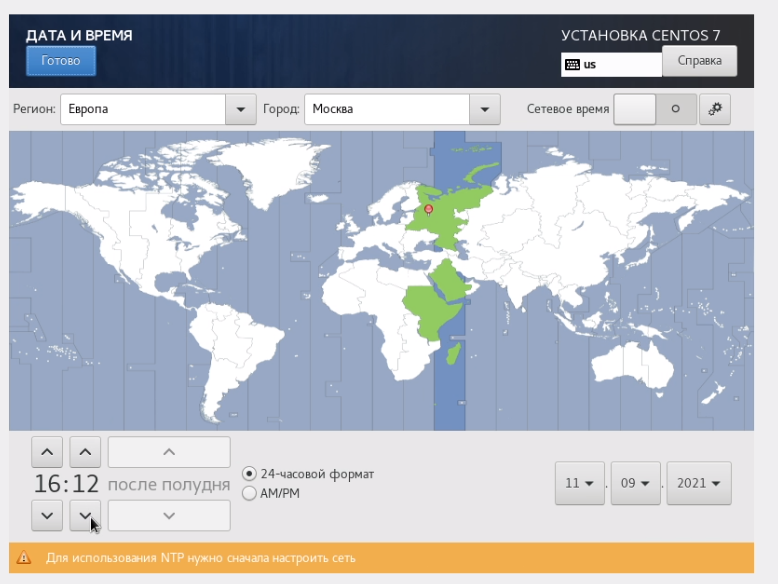
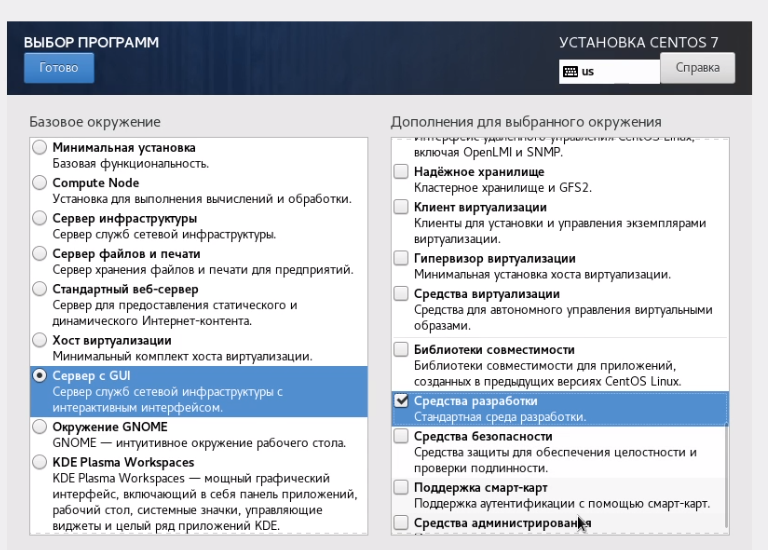
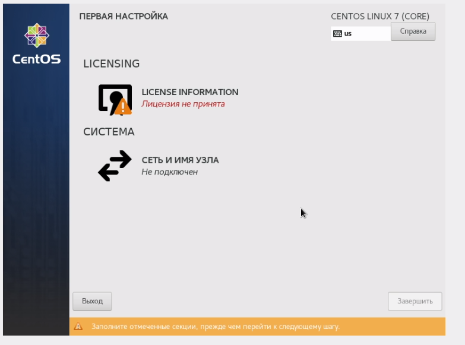
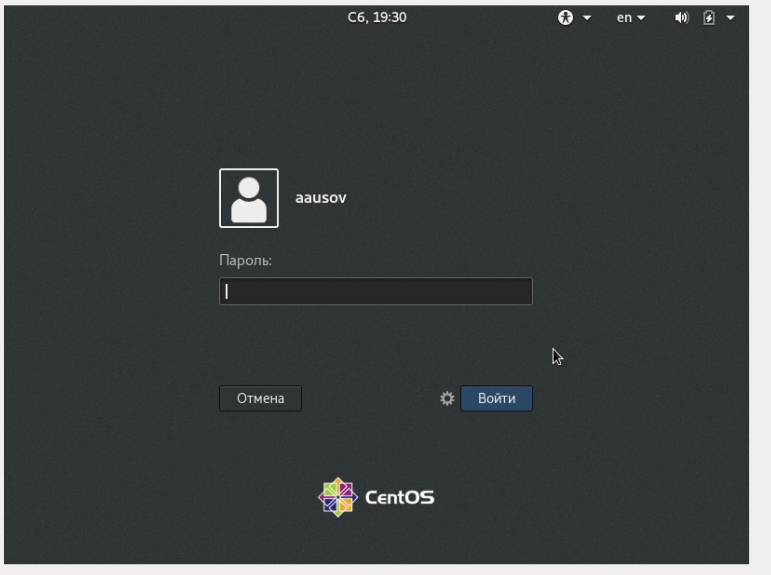

---
## Front matter
lang: ru-RU
title: Лабораторная работа №1
author: |
	Alexandr A. Usov
institute: |
	\inst RUDN University, Moscow, Russian Federation
date: September, 2021 Moscow

## Formatting
toc: false
slide_level: 2
theme: metropolis
sansfont: PT Sans
header-includes: 
 - \metroset{progressbar=frametitle,sectionpage=progressbar,numbering=fraction}
 - '\makeatletter'
 - '\beamer@ignorenonframefalse'
 - '\makeatother'
aspectratio: 43
section-titles: true
---

# Цель работы

## Цель работы

Приобретение практических навыков установки операционной системы на виртуальную машину, настройки минимально необходимых для дальнейшей работы сервисов.

# Задание

## Задание

1. Запустить терминал. Перейти в каталог /var/tmp
2. Создать каталог с именем пользователя (желательно совпадающим с логином студента в дисплейном классе)
3. Скопировать образ виртуальной машины в папку, созданную на предыдущем шаге.
4. Ностроить VirtualBox
5. Запустить виртуальную машину и установить систему

# Ход работы

## Шаг 1 - Подготовка
1. Загрузил операционную систему Linux.
Осуществил вход в систему. 
2. Запустил терминал. Перешел в каталог /var/tmp 
3. Создал каталог с именем пользователя 
4. Скопировал образ виртуальной машины
в созданный на предыдущем шаге каталог

## Скриншот для шага 1
{ #fig:001 width=70% }

## Шаг 2 - Запустил виртуальную машину
{ #fig:002 width=70% }

## Шаг 3.1 - Создал новую виртуальную машину

{ #fig:004 width=70% }

## Шаг 3.2 - Создал новую виртуальную машину

{ #fig:005 width=70% } 

## Шаг 3.3 - Создал новую виртуальную машину

{ #fig:006 width=70% }

## Шаг 3.4 - Создал новую виртуальную машину

{ #fig:007 width=70% }

## Шаг 3.5 - Создал новую виртуальную машину

{ #fig:008 width=70% }

## Шаг 3.6 - Создал новую виртуальную машину

{ #fig:009 width=70% }

## Шаг 4 - Выбрал в VirtualBox Свойства Носители виртуальной машины Base. Добавил новый привод оптических дисков и выбрал образ.

{ #fig:010 width=70% }

## Шаг 5 - Запустил установку системы
{ #fig:028 width=70% }

## Шаг 6 - Установил русский язык для интерфейса и раскладку клавиатуры 

{ #fig:011 width=70% }

## Шаг 7 - Указал часовой пояс(рис. -@fig:012)

{ #fig:012 width=70% }

## Шаг 8.1 - Выбрал программы для установки

{ #fig:013 width=70% }

## Шаг 8.2 - Выбрал программы для установки

{ #fig:014 width=70% }

## Шаг 9.1 - Начал установку. 

{ #fig:015 width=70% }

## Шаг 9.2 - Задал root пароль

{ #fig:016 width=70% }

## Шаг 9.3 - Создал пользователя-администратора со своим именем

{ #fig:017 width=70% }

## Шаг 9.4 - Установка

{ #fig:018 width=35% }

{ #fig:019 width=35% }

## Шаг 10 - Принял лицензию

{ #fig:020 width=35% }

{ #fig:021 width=35% }

## Шаг 11 - Войти в систему 

{ #fig:022 width=35% }

{ #fig:023 width=35% }

## Шаг 12 - Установить обновления

{ #fig:024 width=35% }

{ #fig:025 width=35% }

## Шаг 13 - Установить программу (Например, mc)

{ #fig:026 width=35% }

{ #fig:027 width=35% }

# Вывод

## Вывод

Выполняя данную лабораторную работу, я приобрел навыки установки CentOS 7 на виртуальную машину и настройки минимально необхлдимых для дальнейшей работы сервисов.

## {.standout}

Спасибо за внимание!
