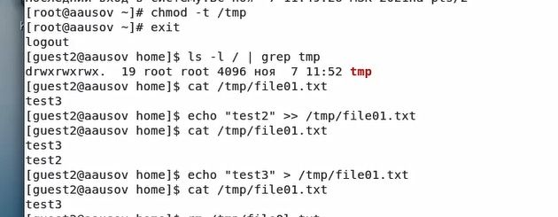

---
## Front matter
lang: ru-RU
title: Лабораторная работа №5
author: |
	Александр Усов
institute: |
	 RUDN University, Moscow, Russian Federation
date: Сентябрь, 2021 Москва

## Formatting
toc: false
slide_level: 2
theme: metropolis
sansfont: NotoMono-Regular
header-includes: 
 - \metroset{progressbar=frametitle,sectionpage=progressbar,numbering=fraction}
 - '\makeatletter'
 - '\beamer@ignorenonframefalse'
 - '\makeatother'
aspectratio: 43
section-titles: true
---

# Прагматика выполнения лабораторной работы

Предположим вы хотите защитить некоторые важные файлы в Linux. При чем они должны быть защищены не только от перезаписи 
но и от случайного или преднамеренного удаления и перемещения. Предотвратить перезапись или изменение битов доступа к файлов 
можно с помощью стандартных утилит chmod и chown, но это не идеальное решение, так как у суперпользователя по прежнему остается полный доступ. 
Но есть еще одно решение. Это команда chattr.
Эта утилита позволяет устанавливать и отключать атрибуты файлов, на уровне файловой системы не зависимо от стандартных (чтение, запись, выполнение). 

# Цель работы

## Цель работы

Изучение механизмов изменения идентификаторов, применения
SetUID- и Sticky-битов. Получение практических навыков работы в консоли с дополнительными атрибутами. Рассмотрение работы механизма
смены идентификатора процессов пользователей, а также влияние бита
Sticky на запись и удаление файлов.

# Задачи

## Задачи

1. Создать и проверить работу файла simpleid.c
2. Расширить работу файла simpleid2.c и проверить работу с разными атрибутами
3. Создать программу  readfile.c и проверить атрибуты на нем.

# Результат

## Опробовали новые атрибуты

{ #fig:006 width=70% }

## Исследовали Sticky-бит

{ #fig:014 width=70% }

## Вывод

В результате выполнения работы вы повысили свои навыки использования интерфейса командой строки (CLI), познакомились на примерах с тем,
как используются основные и расширенные атрибуты при разграничении
доступа. Имели возможность связать теорию дискреционного разделения
доступа (дискреционная политика безопасности) с её реализацией на практике в ОС Linux. Опробовали действие на практике расширенных атрибутов «а» и «i».

## {.standout}

Спасибо за внимание!
